# Cardsmith

An [Obsidian](https://obsidian.md) plugin that turns your notes into
print-ready, double-sided card decks — board game components, reference
cards, flash cards, any deck you print.

A note is a card. A folder of notes is a deck. A *system* gives the cards
their look and vocabulary: Cardsmith bundles [twelve](#bundled-systems)
and lets you write your own in the vault.

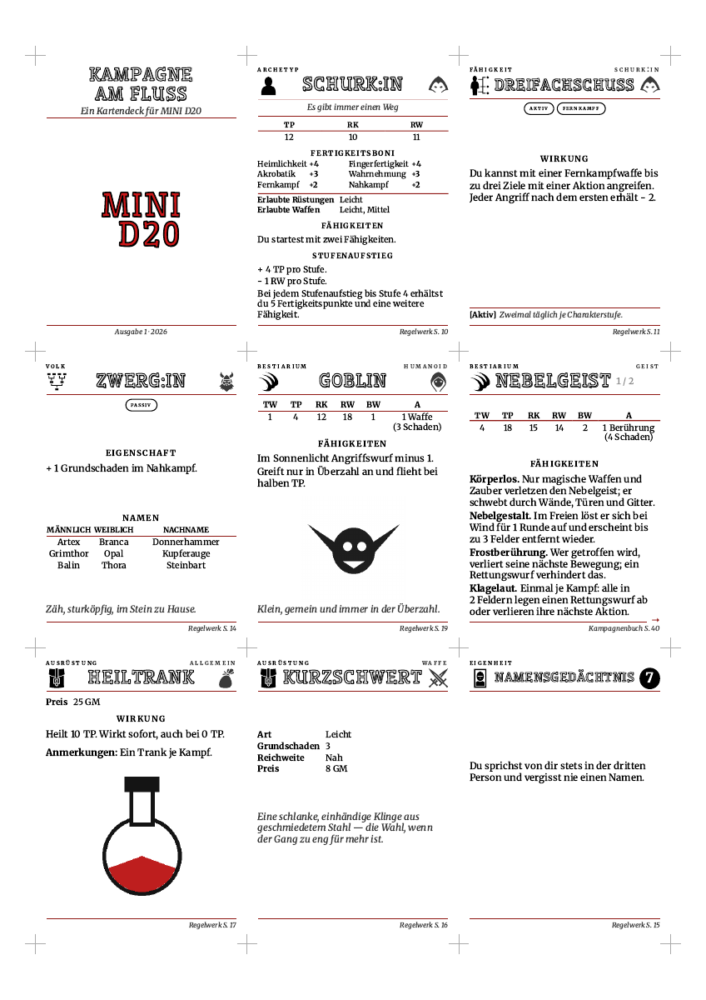

The back of the same sheet, mirrored for duplex printing — the last card
spilled onto a second one, and the sheet knows:

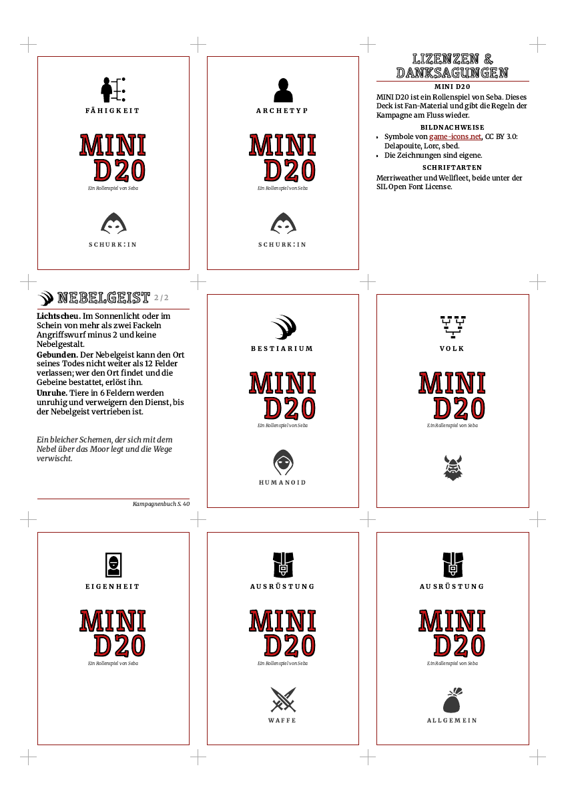

## Install

- **From Obsidian**: *Settings → Community plugins → Browse*, search for
  *Cardsmith*, install, enable. (Until the plugin is in the list, install
  it through [BRAT](https://github.com/TfTHacker/obsidian42-brat): add the
  repository `manolitto/obsidian-cardsmith` there.)
- **From a checkout**, for development: link the repository into a vault's
  plugin folder and enable the *Hot Reload* community plugin there.

  ```bash
  ln -s "$(pwd)" /path/to/vault/.obsidian/plugins/cardsmith
  ```

Cardsmith needs Obsidian 1.8.7 or newer. The PDF export needs the desktop
app; everything else works on a phone too.

## Sixty seconds

Put a `cardsmith` block in a note. This one uses the bundled `simple`
system:

````yaml from=tests/fixtures/simple/Rope of Climbing.md
```cardsmith
card:
  system: simple
  card-type: simple
data:
  content: "Sixty feet of silk rope that climbs on command."
  game-name: "Chronicles of the Ember Coast"
  card-type-label: "Wondrous Item"
```
````

In reading view the block shows the card, front and back, as it will
print:


The title is the note's name; everything else is a property the
system knows — `content`, `game-name`, `reference` — written under
`data:`, in the note's frontmatter, as the note's own text and `##`
sections, as [Dataview](https://blacksmithgu.github.io/obsidian-dataview/)-style
inline fields, or in a
[Fantasy Statblocks](https://plugins.javalent.com/statblocks) block a note
already has. *Insert sample card block at cursor* in the command palette
writes a block with every property filled in, and *Show property
reference* lists them.

To print a folder of such notes, add a deck note beside them:

````yaml from=tests/fixtures/simple/_deck.md
```cardsmith-deck
system: simple
```
````

The block shows how many cards it found and three buttons: *Preview*,
*Export PDF*, *Export HTML*. The PDF lands beside the note — fronts and
backs on alternating pages, so a duplex print comes out aligned — and
opens in a new pane.

## Bundled systems

Twelve card designs ship with the plugin, each with its card types: pick
the system in the block, name the card type, and the note prints in that
design. Each picture is one card of the system, front and back, as it
prints; [Bundled systems](docs/systems.md) shows every card type of every
one, with sizes, languages and the terms each design comes under. A
system is also the thing to copy into the vault and make your own.

| | |
|---|---|
| 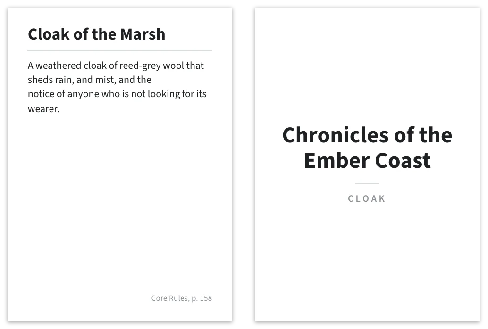<br>[**simple**](docs/systems.md#simple) — any game<br>`simple` | 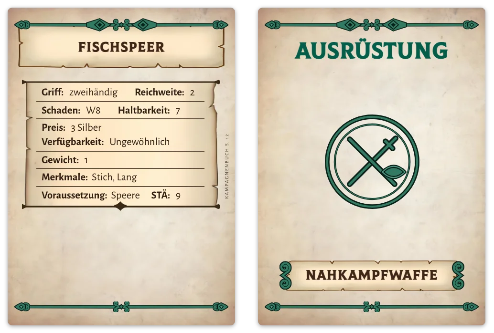<br>[**dragonbane**](docs/systems.md#dragonbane) — *Dragonbane*<br>`gear` `creature` `rule` `roll-table` `generic` |
| 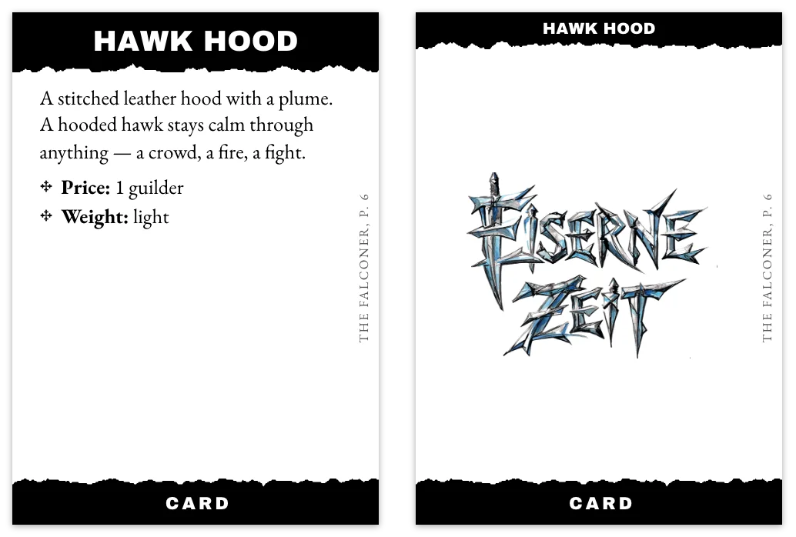<br>[**eiserne-zeit**](docs/systems.md#eiserne-zeit) — *Eiserne Zeit*<br>`generic` | 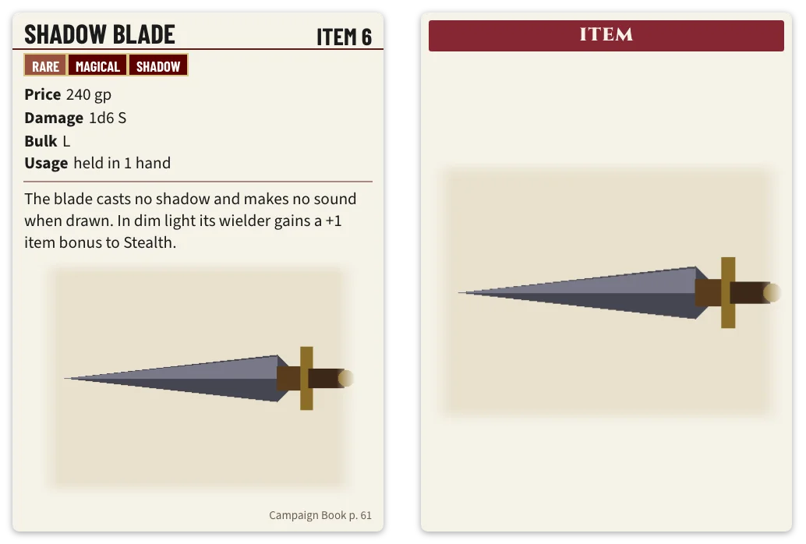<br>[**pf2e**](docs/systems.md#pf2e) — *Pathfinder Second Edition*<br>`creature` `item` `feat` `action` `trap` |
| 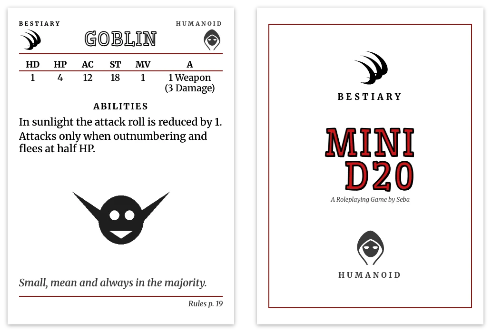<br>[**mini-d20**](docs/systems.md#mini-d20) — *MINI D20*<br>`archetype` `ability` `heritage` `bestiary` `equipment` `quirk` `cover` `generic` | 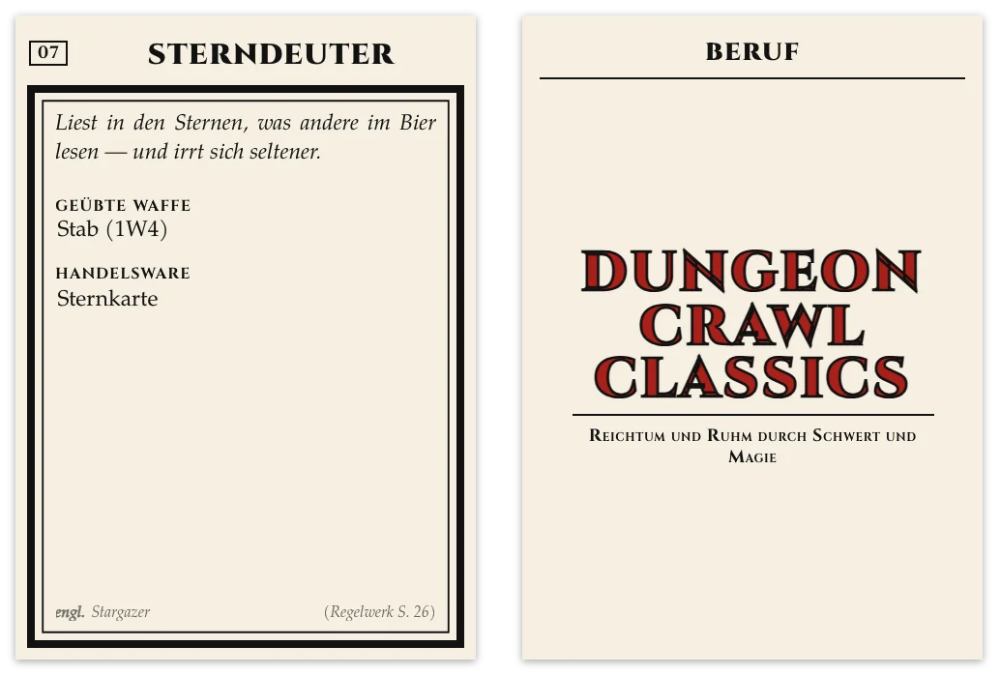<br>[**dcc**](docs/systems.md#dcc) — *Dungeon Crawl Classics*<br>`occupation` `equipment` |
| 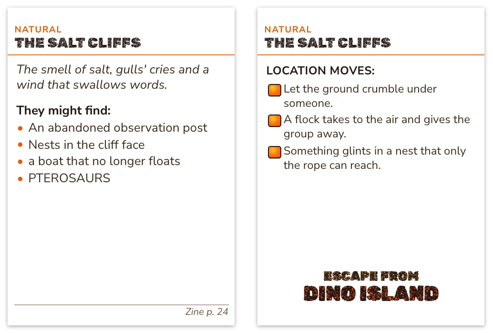<br>[**dino-island**](docs/systems.md#dino-island) — *Flucht von Dino Island*<br>`location` `taxonomy` `roll-table` | 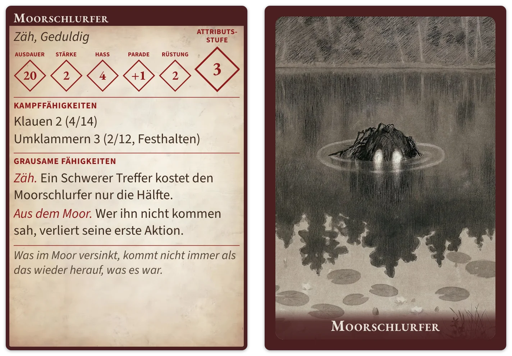<br>[**tor2e**](docs/systems.md#tor2e) — *The One Ring*, second edition<br>`gear` `npc` |
| 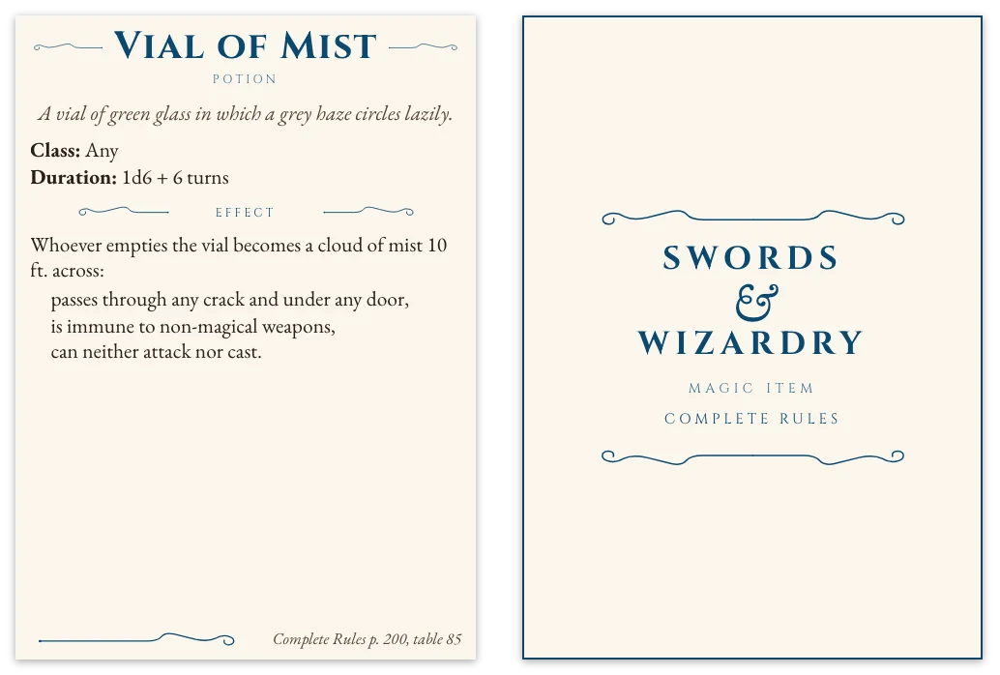<br>[**sw**](docs/systems.md#sw) — *Swords & Wizardry*<br>`item` `monster` | 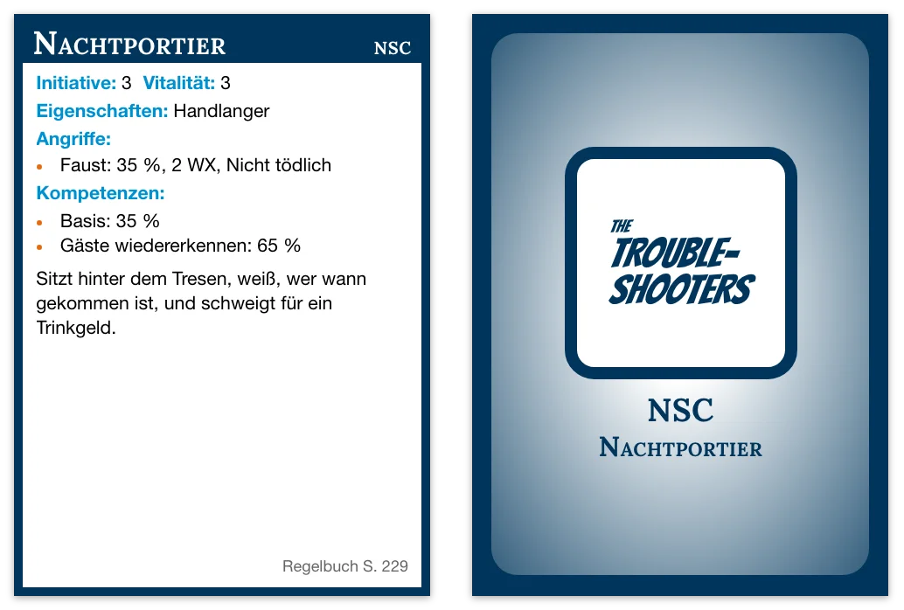<br>[**troubleshooters**](docs/systems.md#troubleshooters) — *The Troubleshooters*<br>`npc` `mechanic` `gear` |
| 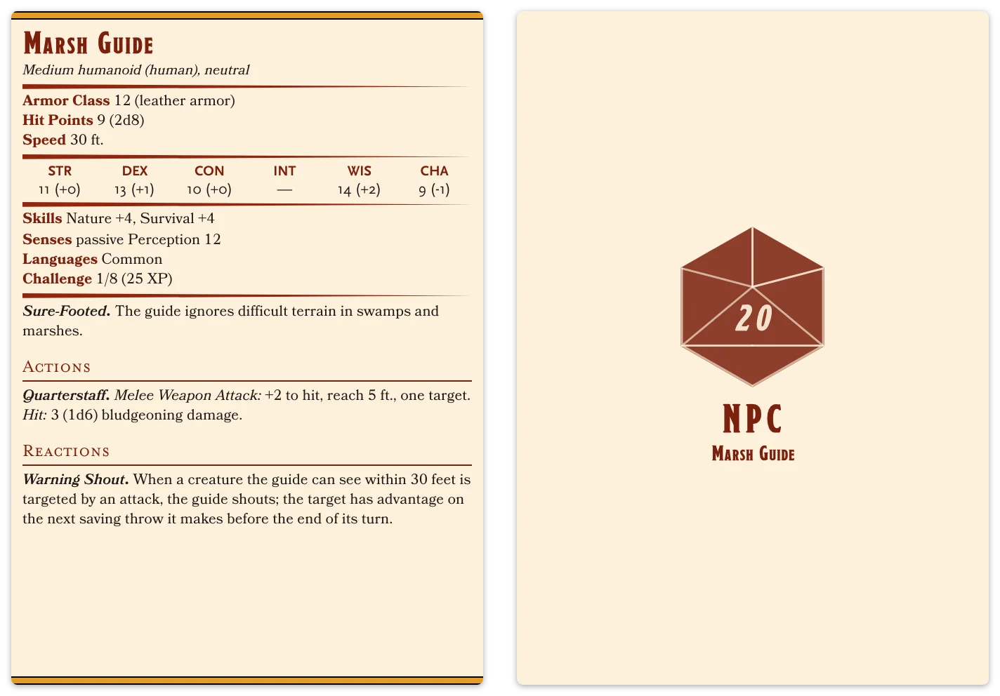<br>[**5e**](docs/systems.md#5e) — fifth-edition play (SRD 5.1)<br>`monster` `npc` | 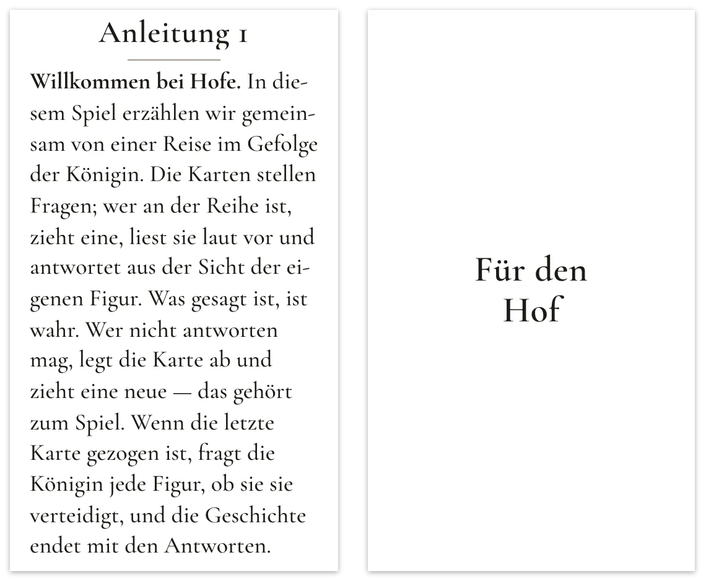<br>[**dftq**](docs/systems.md#dftq) — games *Descended from the Queen*<br>`prompt` |

**These twelve are a start**, not the catalogue: more bundled systems
are on the way, and a system does not have to be bundled to be shared.
A system is one folder — a YAML root document, templates, a stylesheet,
fonts — and any vault can run one: unzip the folder into the vault, pick
its root document under *Add a vault system* in the settings, and every
note that names it prints in that design. So a new system, an improved
one or a different take on a game the plugin already covers is yours to
publish the moment it works: zip the folder and put it where others can
download it. That is the easiest way to contribute — no build, no pull
request — though a pull request that bundles it is welcome too;
[Writing a system](docs/authoring/system.md) shows how to start from a
copy of `simple`, and [CONTRIBUTING.md](CONTRIBUTING.md) the rest.

## What is in the box

| | |
|---|---|
| [Cards](docs/cards.md) | The `cardsmith` block: card settings, where a card's properties come from, tables that make one card per row, pictures, the preview |
| [Decks](docs/decks.md) | The `cardsmith-deck` block: selecting notes, sort order, copies, card and paper sizes, cut marks, duplex, the two exports and the preview pane |
| [Settings](docs/settings.md) | The systems list, adding your own, copying a bundled one into the vault, the three preferences |
| [Bundled systems](docs/systems.md) | The twelve card designs that ship with the plugin, their card types, sizes and languages |
| [Writing a system](docs/authoring/system.md) | A folder with a YAML root document, templates, stylesheets and fonts — starting from a copy of `simple` |

## Licence

MIT for the code. The bundled fonts, icons, images and the games the
systems are drawn for carry their own terms — [NOTICE.md](NOTICE.md)
lists them. Cardsmith is an unofficial, fan-made tool, affiliated with
none of the publishers named there.
